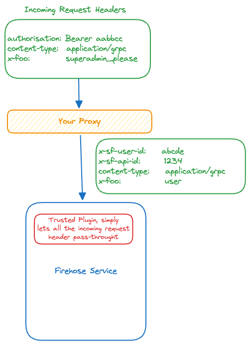
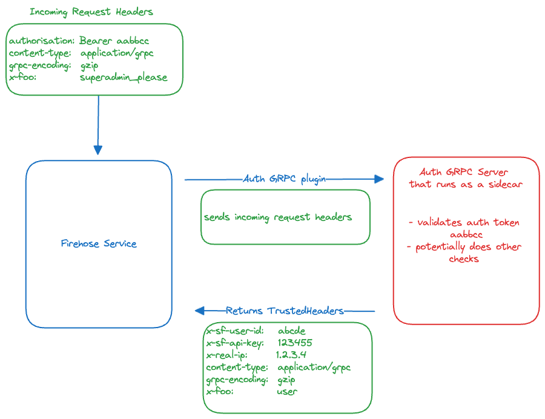

# StreamingFast Auth Library

This is StreamingFast authentication library. 

## How it works

At it's core StreamingFast services will look for a `TrustedHeaders` object within
the context to get user and request information. The `dauth` library offers two abstractions (called plugins) to set up a `TrustedHeaders` object in the context:

- Trusted Plugin
- GRPC Plugin

You can think of `TrustedHeaders` as HTTP headers. StreamingFast services will expect (assuming the call is authenticated) at-least 3 headers to identify the user.

- `x-sf-user-id`
- `x-sf-api-key-id`
- `x-real-ip`

To control the execution of Substreams on a per user basis, the following `TrustedHeaders` can be set:

- `x-sf-substreams-parallel-jobs`

### Plugins

An auth plugin will take as input the incoming HTTP Headers, as well as the ip address, and will return trusted headers. How the plugin determines 
which header to keep or trust is up to the implementation. The plugin is configured via a specific DSN. We currently support 3 plugins

- Trusted Plugin: `trust://`
- gRPC Plugin: `grpc://hostname:port`
- Null Plugin: `null://`

*Trusted Plugin*

The trusted plugin simply acts as a pass-through. It will trust all incoming headers. This should be used if the proxy layer does the authorization and sets the trusted headers.

*GRPC plugin*

The gRPC plugin will perform a grpc request to the defined endpoint. The response will contain the `TrustedHeaders`. An example of this would be a `grpc://localhost:9000` where 
the gRPC service is a sidecar. This sidecar could, for example, read a JWT from the incoming `Authorization` header and return the appropriate values for the *TrustedHeaders* `x-sf-user-id` and `x-sf-api-key-id`.

The motivation behind the gRPC plugin is to give the operator flexibility in implementing their authentication layer. 

Please note that when using this plugin in a Substreams tier1/tier2 infrastructure, then only the tier1 nodes should authenticate requests using gRPC, while all tier2 nodes should use the Trusted Plugin (`trust://`) instead. Subrequests to tier2 nodes have already been authenticated on tier1 nodes so re-authenticating on tier2 nodes is not neccessary and might result in undesired effects such as JWT expiration in running Substreams.

*Null Plugin*

The null plugin does not keep or trust any header from the requests. It returns an empty string to any Get() function.

## Contributing

**Issues and PR in this repo related strictly to the dauth library.**

Report any protocol-specific issues in their
[respective repositories](https://github.com/streamingfast/streamingfast#protocols)

**Please first refer to the general
[dfuse contribution guide](https://github.com/streamingfast/streamingfast/blob/master/CONTRIBUTING.md)**,
if you wish to contribute to this code base.

## License

[Apache 2.0](LICENSE)
